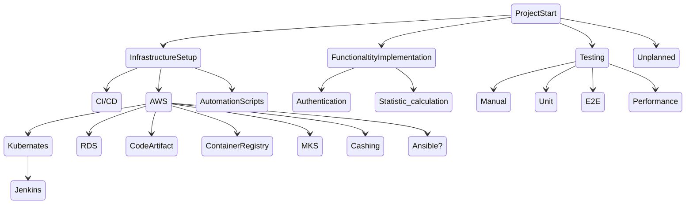

# yellow-taxi
Promotion project

Sample diagram:

```mermaid
stateDiagram-v2
    ProjectStart --> InfrastructureSetup
        InfrastructureSetup --> CI/CD
        InfrastructureSetup --> AWS
            AWS --> Kubernates
                Kubernates --> Jenkins
            AWS --> RDS
            AWS --> CodeArtifact
            AWS --> ContainerRegistry
            AWS --> MKS
            AWS --> Cashing
            AWS --> Ansible?
        InfrastructureSetup --> AutomationScripts
    ProjectStart --> FunctionaltityImplementation
        FunctionaltityImplementation --> Authentication
        FunctionaltityImplementation --> Statistic_calculation
    ProjectStart --> Testing
        Testing --> Manual
        Testing --> Unit
        Testing --> E2E
        Testing --> Performance
    ProjectStart --> Unplanned
    
```

